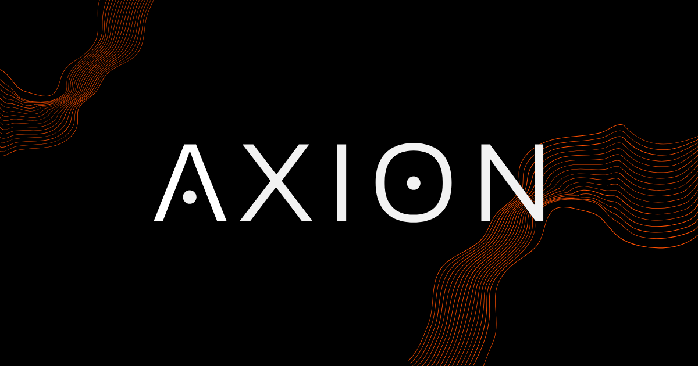

<p align="center" style="padding-top: 40px; padding-bottom:40px;">
  
</p>

<p align="center">
  
  
  
  
</p>

O **Axion** nasce de uma necessidade real: autodidatas têm disciplina para estudar, mas perdem tempo filtrando conteúdo duvidoso. Diferente de plataformas de cursos tradicionais, o Axion é uma plataforma aberta de trilhas de estudo - qualquer usuário pode criar, compartilhar e organizar suas próprias trilhas, seja como guia público para a comunidade ou como o registro pessoal privado.

> Futuramente será incluído também o link da _landing page_.

## Qual o propósito desse repositório?

Esse repositório foi criado no intuito de servir como hub de todos os repositórios que envolvem o projeto **Axion**, sendo eles:

- [Axion Frontend](https://github.com/genzo-dev/axion-frontend)
- [Axion Backend](https://github.com/genzo-dev/axion-backend)
- [Axion Docs](https://github.com/genzo-dev/axion-docs)

> [!NOTE]
> Conforme o projeto avançar, novos repositórios podem ser incluídos nessa seção.

## Estado do projeto

O projeto está separado em fases (0 - 5), onde cada fase só deverá ser implementada após a anterior ser concluída. Atualmente o projeto está na **Fase 1 - MVP**.

Para mais detalhes acesse o arquivo ```FASES.md``` localizado no repositório de documentação ([Axion Docs](https://github.com/genzo-dev/axion-docs)).

> [!IMPORTANT]
> O projeto deve ser lançado após a **Fase 1 - MVP** ser concluída.
>
> Após o lançamento, as próximas fases devem começar a ser implementadas, de acordo com a ordem.

## Como rodar a aplicação?

1. **Backend** — Acesse [Axion Backend](https://github.com/genzo-dev/axion-backend), siga o setup e escolha o ambiente (dev/test/staging).

2. **Frontend** — Acesse [Axion Frontend](https://github.com/genzo-dev/axion-frontend), instale as dependências e inicie.

3. **Acessar** — Com ambos no ar, as rotas estarão disponíveis (consulte os READMEs de cada repositório).

> [!NOTE]
> Essa seção poderá ser atualizada com novos passos conforme o projeto evoluir.

## Autor

<div align="center">
  
</div>

<div align="center">
  <strong>Gabriel Enzo (genzo-dev)</strong>
</div>

<div align="center">
  <sub>
    Fullstack web developer
  </sub>
</div>

&nbsp;

<div align="center">
  <a href="https://www.linkedin.com/in/gabriel-enzo-200403233/">💼 LinkedIn</a>
  |
  <a href="https://github.com/genzo-dev">🐙 GitHub</a>
</div>